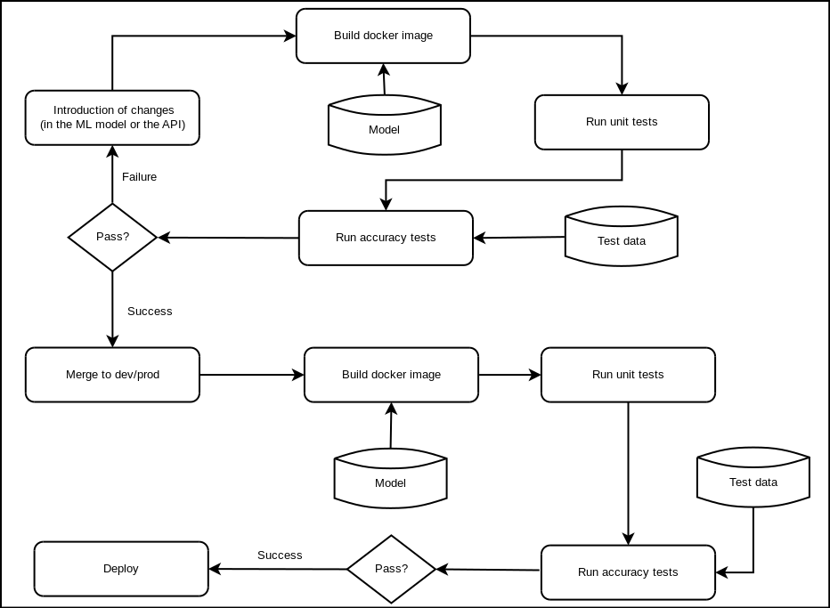

ThirdLove Machine Learning Engineer Interview Exam
==================================================

This README contains all the information relevant to the interview process and
exam given at ThirdLove.

Section 1 Answers
-----------------

Please refer to the file `exam/SECTION1.txt` in order to check the answers to
the questions of Section 1.

Application README
------------------

### Description of the application

The selected project is a very simple algorithm for recommending movies
according to some metadata from the user: age, gender and occupation (from a
list of possible occupations).

For the purpose of this exam, the model trained for the task is not thoroughly
optimized, and is limited to the list of movies given by the dataset [movielens
ml-100k](http://files.grouplens.org/datasets/movielens/ml-100k/).

For the model I used a simple random forest regression algorithm trained with
the previously mentioned dataset that, given a list of user metadata and a
movie from the list tries to guess the rating the user would give to the movie.
Based on that, the API should retrieve a list of the top X movie
recommendations for that user.

### Design of the API

The API's specification is the following:

| Method   | URL                    | Parameters                                                                | Response                                                                                                                                      |
| -------- | ---------------------- | ------------------------------------------------------------------------- | --------------------------------------------------------------------------------------------------------------------------------------------- |
| `GET`    | `/`                    |                                                                           | 200 - Welcome message                                                                                                                         |
| `GET`    | `/protected`           |                                                                           | 200 - `{"message": "Protected"}` ; 401 - Unauthenticated session                                                                              |
| `POST`   | `/api/login`           | `{"session_password": string}`                                            | 200 - `{"access_token": string}` ; 400 - Missing password ; 401 - Invalid password                                                            |
| `POST`   | `/api/recommend`       | `{"age": int, "gender": string, "occupation": string , "max_recs"?: int}` | 200 - `{"recommendations": list of string, "id": string}` ; 400 - Invalid age, gender, occupation or max_recs ; 401 - Unauthenticated session |
| `POST`   | `/api/recommend/score` | `{"id": string, "movie": string, "score": float`                          | 200 - `"Ok"` ; 400 - Invalid id, movie or score ; 401 - Unauthenticated session                                                               |

This API is quite simple as the main purpose is just to serve as an interface
for the served model, which is a simple one as well. There are 4 resources
available.

The first two URIs presented in the table are there for testing purposes. The
first is a basic test to see the application is effectively working.  The
second URI is only accessible after logging into the application, thus it is
useful to test if the JWT Token Authentication is correctly working.

The third resource: `/api/login` is needed to authenticate the session, with
the password given when running the server (check section **Running the
application**).  It expects the `session_password` as parameter and returns the
`access_token`. 

Next, the resource: `/api/recommend` is the key resource for this application,
as is the one that effectively does the recommendation based on user metadata.
It takes three obligatory parameters and an optional parameter:

1. `age`: The age of the user. Must be a valid integer.
2. `gender`: The gender of the user. Must be one of the following:
    - `M`: Male.
    - `F`: Female.
    - `O`: Other.
3. `occupation`: The occupation of the user.
    - `administrator`
    - `artist`
    - `doctor`
    - `educator`
    - `engineer`
    - `entertainment`
    - `executive`
    - `healthcare`
    - `homemaker`
    - `lawyer`
    - `librarian`
    - `marketing`
    - `none`
    - `other`
    - `programmer`
    - `retired`
    - `salesman`
    - `scientist`
    - `student`
    - `technician`
    - `writer`
4. `max_recs`: Optional. Integer with the maximum number of movies to retrieve. 
    Defaults to 10.

Given those, it will retrieve a list of movie titles sorted by the model
scores. Once again, this model is not thoroughly optimized, so the titles may
not reflect the best performance available. Also, the resource returns an id
for the request that is indented to use for logging purposes.

Finally, the resource `/api/recommend/score` is the resource needed for logging
how well the recommendations turn out for the user, and use that information to
improve the model further. This takes three parameters:

1. `id`: Is the id of the request generated by the URI `/api/recommend` to
   identify the request.
2. `movie`: The title of the movie being scored.
3. `score`: The real score given by the user.

The idea of this resource in the schema of this application is to connect to a
simple form that is presented to the user and can be used as feedback for the
given evaluations. Though this is a very naive approach, it is useful enough
for a first prototype of the application.

#### Note on the API implementation

This API structure is abstract enough to be almost model independent. However,
for this particular case, I decided it was simpler to let the API do some
minimal pre-processing work, thus, it will not work with any scikit-learn
model. In any case, as long as the model follows some kind of pattern, the API
could be easily adapted to a new model (e.g. if the model was trained with a
library other than scikit-learn, it would be easy enough to just get the
parameters and replicate those on a scikit-learn model and use in this API, or
just plug the model from another library into the `/api/recommend` view).

### Running the application

#### Running locally

To run the application locally first you need to create a [virtual
environment](https://virtualenv.pypa.io/en/latest/), and install the
requirements with:

    pip install -r requirements.txt

Then run the application with the following command:

    ML_MODEL_PATH=path/to/model.pkl SESSION_PASSWORD=test python ./main.py --port 5000 --debug

Where `path/to/model.pkl` must be the path to the pickle file with the model
and `SESSION_PASSWORD` is the password needed to access the service.

#### Running the application on Docker

To run the application you need [to install docker](https://docs.docker.com/install/).

Build the image with the following command:

    docker build -t <image_name> --build-arg MODEL_FILE=path/to/model.pkl --build-arg MODEL_TEST_FILE=path/to/test_data.json

The build arguments `MODEL_FILE` and `MODEL_TEST_FILE` are optional and, if not
given, will use the files in the `model/` directory (provided that the
repository has been cloned with [Git LFS
support](https://git-lfs.github.com/)).  The model file should be named
`model.pkl` or being a `.tar.gz` file with a single file named `model.pkl`.
The purpose of these files is discussed in the section **Testing model
accuracy**.

Instantiate the image in a container with the following command:

    docker run -d --rm -p 5000:80 -v path/to/model/dir:/model -e ML_MODEL_PATH="/model/model.pkl" -e SESSION_PASSWORD="test" --name <container_name> <image_name>

Where `path/to/model/dir` is the path tha holds the file `model.pkl`.  If
`MODEL_PATH` is not given, the server will use the default value created when
the Docker image was built (note: in this case, you should not mount the volume
with the `-v path/to/model/dir:/model` argument).

##### Troubleshoot while running the model on Docker

The image will be built and tested on build. If the tests fails, the image
might be dangling, check there's no container of the image with the following
command:

    docker ps -a

If there is a container remove it with:

    docker rm <container_id>
    
Finally, remove the dangling image with the following command:

    docker rmi $(docker images --filter "dangling=true" -q --no-trunc)

Check (and correct) the erroneous tests and build and run the image again.

### Testing the application

#### Manual test

Manual test of the application can be done via the cURL command. First you need
to authenticate to get an access token:

    curl -X POST -H "Content-type: application/json" -d '{"session_password": "test"}' http://0.0.0.0:5000/api/login

This will return an `access_token` that you need in order to fetch for
recommendations.  Once you have the token, let's assume you store it in a
variable `TOKEN`, you can retrieve recommendations using the following command:

    curl -X POST -H "Content-type: application/json" -H "Authorization: Bearer ${TOKEN}" -d '{"age": 30, "gender": "M", "occupation": "programmer"}' http://0.0.0.0:5000/api/recommend

To test the `/api/recommend/score` endpoint you can use the following command:
    
    curl -X POST -H "Content-type: application/json" -H "Authorization: Bearer ${TOKEN}" -d '{"id": $ID, "movie": $MOVIE, "score": 5.0}' http://0.0.0.0:5000/api/recommend/score
    
Where `$ID` is the id returned by the previous command (the request to the
`/api/recommend` endpoint), and `$MOVIE` is the movie title.

#### Unit testing

The application can be tested locally with the following command (provided the
Python environment was correctly set):

    pytest

In case of a Docker container, the image is tested while being built. But, it
can be tested on a running container as well with the following command:

    docker exec -it <container_name> pytest

#### Testing model accuracy

The `./test/run_accuracy_tests.py` script has the objective to check that a
model loaded in a docker container (or tested locally) achieves as much
performance as it did when originally trained. This is to avoid that the change
of environment affects the general performance of the model. To run this script
you need a test data file.  The test data file is a JSON file with three keys:

1. `data`: Has a list of the data to use to test the model. It should be in the
   format the model expects (e.g. objects, lists of numbers, etc.)
2. `target`: A list with the corresponding "true values" for each instance of
   the `data` field.
3. `expected_score`: A float with the expected score to be obtained by the
   model.

This is why it was needed when creating the Docker image previously. To run the
script locally, you only need to run the following (provided the environment is
correctly set):

    python ./tests/run_accuracy_tests.py path/to/model.pkl path/to/test_data.json [--error-tolerance 0.0001]

The `--error-tolerance` argument is optional (defaults to 1e-5) and defines how
much tolerance we give to the accuracy of the model.

For this particular script the accuracy is actually what the scikit-learn model
considers its score function (e.g. for regression algorithms is R^2). It can be
changed for any other metric easily.

For the case of Docker, when building the image this script will be run. But if
you want to run it on a running container, you can do it with the following
command:

    docker exec -it <container_name> python tests/run_accuracy_tests.py /model/model.pkl /model/test_data.json

### Deployment pipeline for machine learning cycle

The idea behind this pipeline is to merge the traditional ci/cd pipeline for
development and add a layer to setup and check the new models are working
before deployment.

In this case, the idea of a model correctly "working" means that the API has to
pass the unit tests assigned to it plus that the model should be tested against
some known baseline and check that there was not any accuracy lost in the
deployment process.

The best solution I came accross (inspired on the post by [Alvaro Fernando
Lara](https://medium.com/onfido-tech/continuous-integration-for-ml-projects-e11bc1a4d34f))
while building this pipeline was the use of a Docker image that would ensure
the environment compatibility with the one given by the model, thus the
developtment cycle would follow this pattern:

- Introduce the changes to the code or the new model.
- Build a docker image based on these changes.
- Run traditional integration and unit tests over the new model built.
- Run accuracy tests over the model and some given test data.

The workflow can be pictured in the following image:

#### Deploying the application on server

To deploy the application in the server there is a Python script:
`deploy-docker.py` which is in charge of creating the image and running the
container. It takes 5 obligatory parameters:

1. `IMAGE_NAME`: The name of the Docker image to build.
2. `IMAGE_VERSION`: The version of the Docker image to build.
3. `MODEL_FILE`: The path to the scikit-learn model to build the image.
4. `TEST_DATA_FILE`: The path to the test data file to run the model accuracy 
    tests (check **Testing model accuracy** for more information).
5. `SESSION_PASSWORD`: The session password to build the model.

There are other optional parameters as well:

1. `--container-name`: Name of the container. Defaults to the image name.
2. `--port-mapping`: Port in the host machine to map the container's
   application port. Defaults to 80 (HTTP).
3. `--json-log`: Activate to use json logs instead of `journald` logs. Not
   recommended.
4. `--log-tag`: How to tag the logs.

An example of using this script is the following:

    python deploy-docker.py thirdlove 1.0.0 model/model.pkl model/test_data.json test

This will build the image and run the application in a container named
`thirdlove`.

If the scripts builds the image and runs the container successfully, it will
tell how to check the container's logs. In the previous example it can be done
with the following command (provided that `journald` is installed on the host):

    journalctl CONTAINER_NAME=thirdlove

Once the docker image is running, if it was deployed with the deployment script
it will restart on failure up to 5 times before stopping completely.

#### Monitoring the logs

Given the correct deployment of the Docker container via the `deploy-docker.py`
script, we can monitor the logs of the container and send an email when there
is an ERROR (or a WARNING) using a SMTP server (and email address) of our
preference with the `monitor-docker.py` script.

For this we need the deployment to be configure so the logs are stored into
`journald` and we need `journald` installed in the host machine.

The scripts reads from `journald` logs and if it encounters an ERROR it will
send a mail to the configured email.

The script takes 3 obligatory arguments:

1. `CONTAINER_NAME`: The name of the container.
2. `SMTP_SERVER`: The address to the SMTP server to use.
3. `EMAIL`: The email to use (both to send and receive).

There are also some other optional parameters:

1. `--password`: The password to log in to the SMTP server (will be prompted if
   not given).
2. `--print`: Whether to print the `journald` logs to STDOUT.
3. `--smtp-port`: The port of the server. Defaults to 25.
4. `--is-secure`: Whether the SMTP server connection is secure.
5. `--notify-warning`: Whether to notify about "WARNING"s or only "ERROR"s.

An example of using this script is the following:

    ./monitor-docker.py thirdlove smtp.gmail.com crscardellino@gmail.com --print --smtp-port 587 --is-secure

### Overview of the application design

This application was done as a requirement for an interview at ThirdLove.com.
The given to present it time was 2 weeks. Due to this time limitation, I had to
make some design decisions in order to get a working application for what is
similar to a first iteration of a scrum methodology. Thus, the application is
far from complete and could be further improved. However, the application works
and, in general terms, complies with the specifications given. In this last
section I will explain some of the decisions I have made and how they can be
improved.

#### Development

For this application I decided to go with Python as base language because of
its versatility when writing fast prototypes and applications. Plus, the fact
that Python has become one of the most popular language to work on ML related
projects.  The dummy model used as a base for creating the API was trained
using scikit learn, a good tool for developing quick ML algorithms.  It was
decided that the API will be written in Flask because of its lightweight design
that makes it an excellent choice to build microservices.  For authentication,
I used JWT tokens in order to ensure an easy to setup authentication to the
application.  Finally, the simple, yet powerful, pytest Framework was decided
to use for unit testing as it was the one suggested by the Flask documentation.

One thing that is worth noticing was that for this iteration of the application
I decided against the use of a database. As the application was simple enough I
choose to use a more "in memory" approach with logging of all the relevant
information. However, this is only for this first iteration, as eventually the
adding of a DB will become inevitable if I want to have a better control,
specially when it comes to logging data related to machine learning decisions.

#### CI/CD

For the integration and deployment of this application I decided to use Docker
as my baseline. Since the application didn't require a DB for this interation,
I choose a container image that made all the deployment process simpler by
merging the nginx service and the wsgi service into one Docker container.

Nevertheless, I am aware that in order to have a third DB service the preferred
solution would be to have multiple Docker images and use the `docker-compose`
tool for better management of them. That could be a further improvement on the
application on next iterations.

For the CI pipeline I decided to make use of **BitBucket Pipelines** as the
source code was already presented in BitBucket. However, this was simple enough
to be moved to other CI frameworks. Then again, this was my first experience
setting up a CI.

I decided to use Git LFS for managing the data files (models and test data in
this case). However, I am aware that an integration with a service such as
Amazon S3 would be beneficial for this task.

Finally, for the development flow I decided to use [nvie's git flow branching
model](https://nvie.com/posts/a-successful-git-branching-model/) as this is the
one I am most familiar with.
