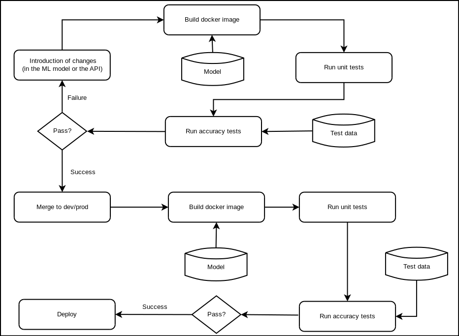

ThirdLove Machine Learning Engineer Interview Exam: Section 2
=============================================================

This file contains the answers to the questions asked in Section 2 of the
ThirdLove interview exam.

Questions
---------

### Deployment pipeline for machine learning cycle

The idea behind this pipeline is to merge the traditional ci/cd pipeline for
development and add a layer to setup and check the new models are working
before deployment.

In this case, the idea of a model correctly "working" means that the API has to
pass the unit tests assigned to it plus that the model should be tested against
some known baseline and check that there was not any accuracy lost in the
deployment process.

The best solution I came accross while building this pipeline was the use of a
Docker image that would ensure the environment compatibility with the one given
by the model, thus the developtment cycle would follow this pattern:

- Introduce the changes to the code or the new model.
- Build a docker image based on these changes.
- Run traditional integration and unit tests over the new model built.
- Run accuracy tests over the model and some given test data.

The workflow can be pictured in the following image:

